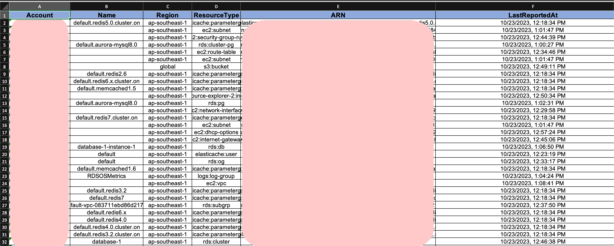
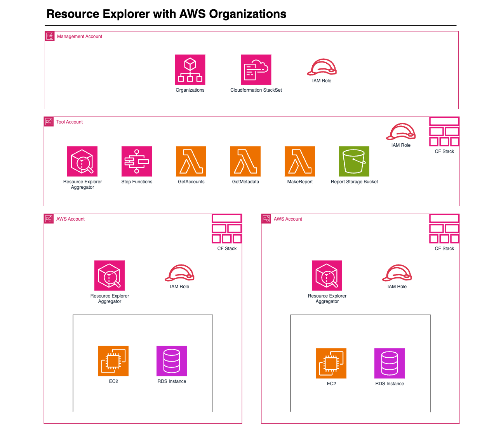
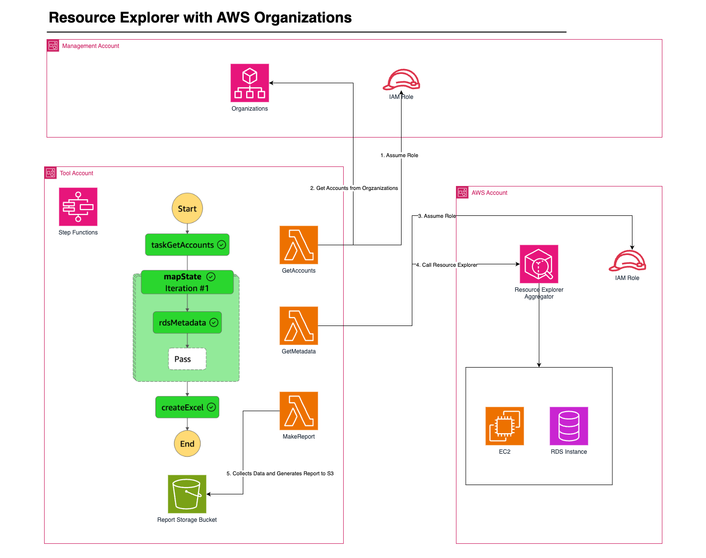

## Cross-account Resource monitoring with AWS Organizations and Resource Explorer 

There are use cases where users are eager to find lingering resources, or resources that were not at their optimal settings.

By utilising Resource Explorer and Step Functions, we can perform workloads over multiple accounts within an organisation. We can therefore gather all the necessary information from these accounts, and use them to create a report to gain a wider understanding of the state of your AWS accounts. 

As of this release, the limitation of Resource Explorer is that it is done on a per account basis. However, one workaround is that we can deploy this to all our accounts in our AWS Organization using StackSets [(See Here)](https://docs.aws.amazon.com/resource-explorer/latest/userguide/manage-service-all-org-with-stacksets.html). This would allow us to perform single queries across accounts to get all resources of specific types.

The use case we are demonstrating here is to find resources in an multiple AWS accounts over multiple regions, and generating an Excel Document displaying the Account it belongs to, Name, Resource Type, and ARN of the resource.

### Services

* AWS Organizations: We need to use AWS Organizations, in order to deploy the necessary stack set and enable resource explorer in all accounts. 
* Step Functions: We use step functions to organise the flow for each AWS account. 
* Lambda: Lambda runs the functions necessary to get the information about each resource. 
* AWS Resource Explorer: Searches for Resources across regions within an account. 
* S3: Store the resulting output. 

### Output

For this workload the output would be a correctly formatted Excel file. This would allow the user to do complex filtering over a variety of parameters in order to detect workloads that are primed for further investigation. 

The excel file will contain  a number of parameters, and worksheets. It will contain a worksheet per account, and include things like the ARN, some performance settings (example given were CPU and database connections). 

Having this overview, and enabling it in Excel, allows you to usudo kise complicated Excel functions to filter RDS, which enables you to get a better view of which RDS Databases are not currently in use. 

An Example of the Excel Worksheet is shown below. 

### Architecture Diagram

### Workload Diagram

### Getting Started

Follow the step by step guide [here](./docs/GettingStarted.md) 

