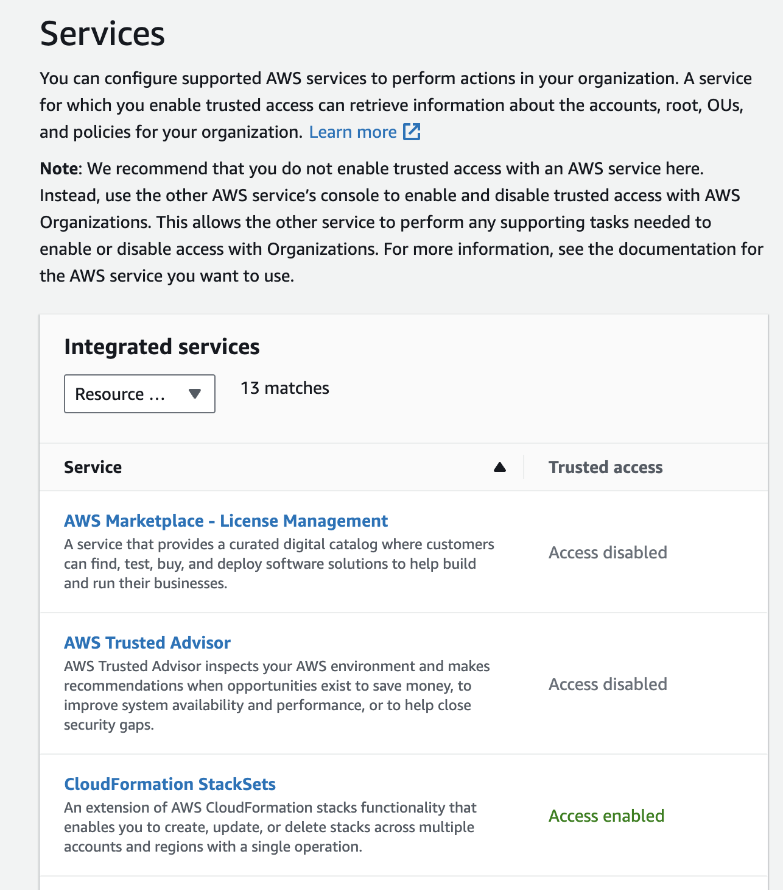
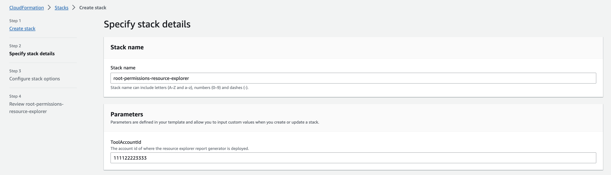
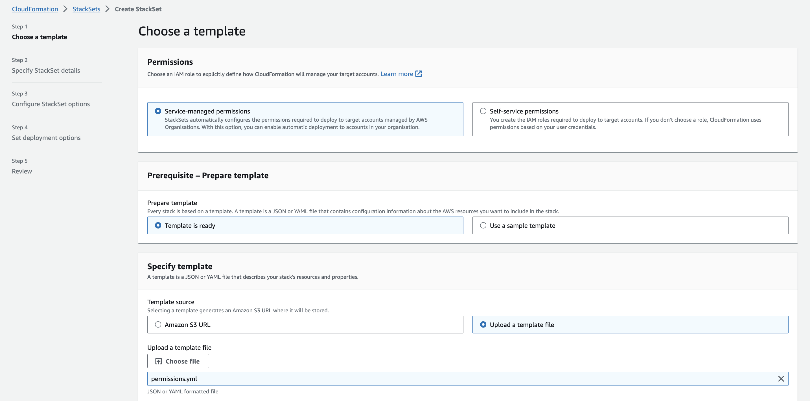
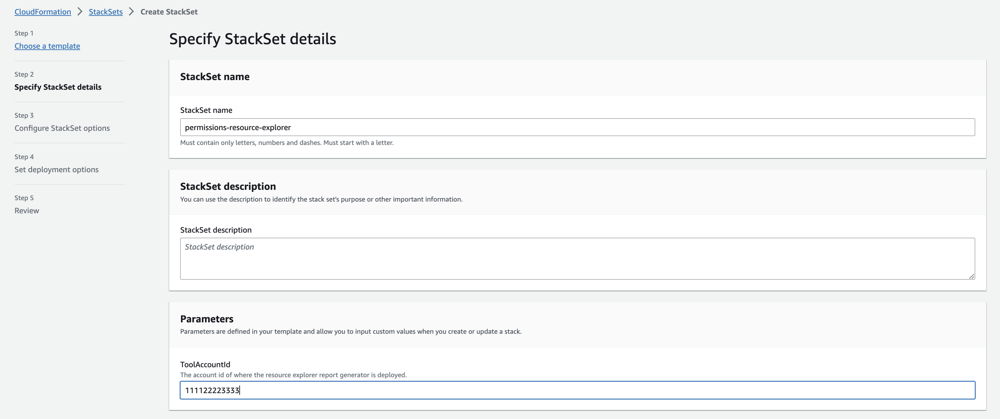
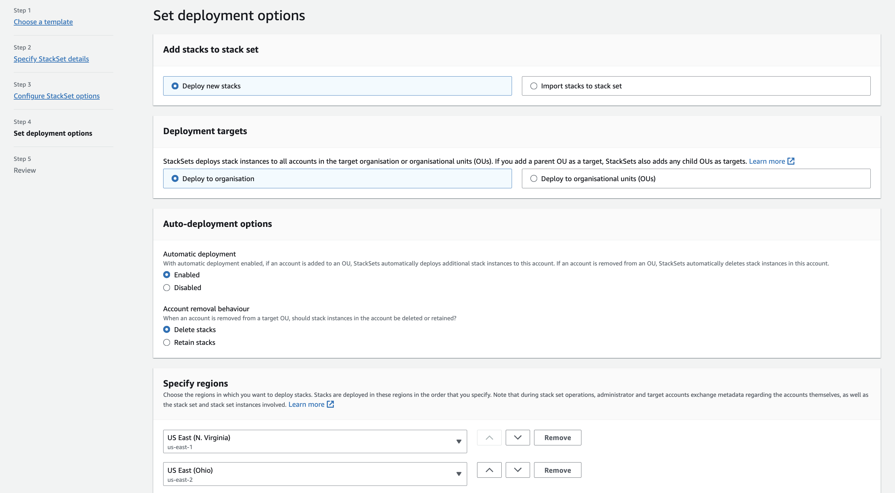
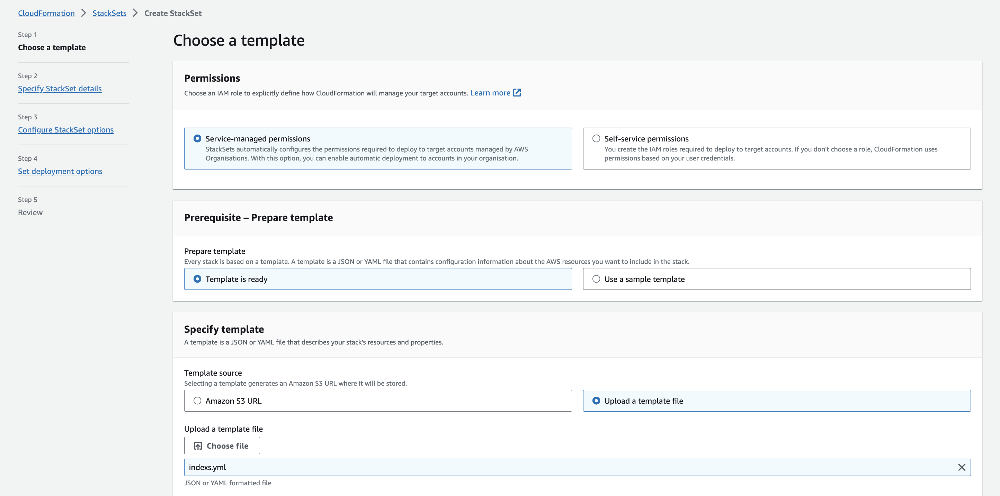
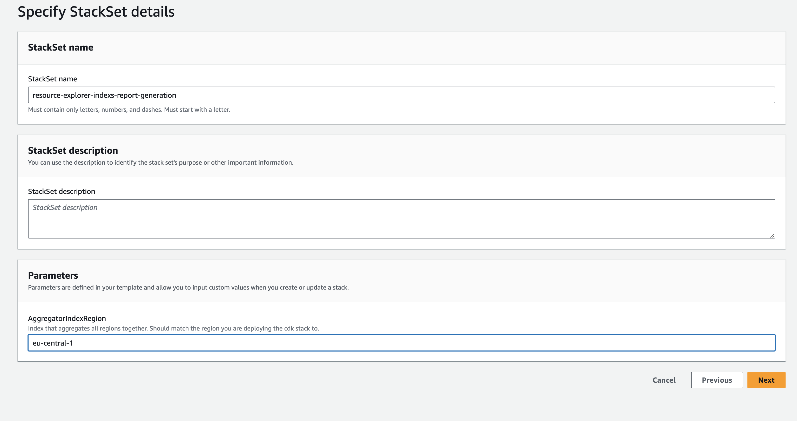
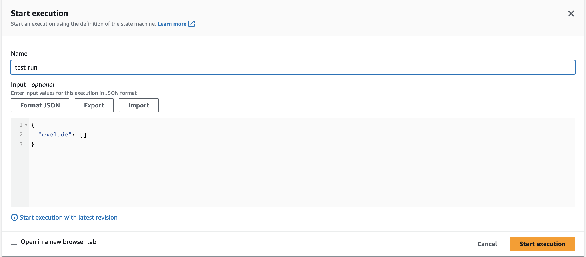
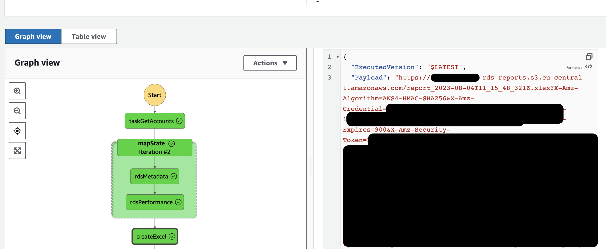

# Getting started

## Install necessary packages
Before you begin, please ensure you run the necessary commands in your repository:

1. Navigate to the root directory of this repository and run `npm install`
2. Navigate to infra/cdk and run `npm install`

## AWS Prerequisites

Please ensure the following prerequisites are met:

1. **AWS Organizations**: If you don't have an AWS Organization, you will need to create one. Organizations allow you to centrally manage multiple AWS accounts.

2. **StackSets Enabled**: You need to enable Trusted Access for AWS Organizations to use AWS CloudFormation StackSets. This allows you to use StackSets to deploy CloudFormation stacks across multiple accounts and regions.

3. **AWS CDK Dependencies**: AWS Cloud Development Kit (CDK) allows you to define cloud infrastructure using familiar programming languages like TypeScript. To transpile TypeScript files into AWS CloudFormation templates, Docker needs to be installed and running on your development environment. Click [here](https://docs.aws.amazon.com/cdk/v2/guide/getting_started.html) to learn more about setting up CDK.

## Deploying Resources 

### 1. Deploying the Root permissions to the Management Account using CloudFormation

* In your Organization **Management account**, deploy the root permissions YAML file which can be found in the directory: [infra/organizations/root-permissions.yml](../infra/organizations/root-permissions.yml). 
* This Stack deploys an IAM role that can be assumed by the **Tool Account** that run the workload. This role allows the **GetAccts Lambda** function deployed in the tool account to list all the accounts within the Organization.

    1. Sign in to your Organization's **Management Account** and navigate to **CloudFormation** (Not StackSets) and create the stack.

        

    2. On creating the stack, you are required you to input the `ToolAccountId` as a parameter.  

        

### 2. Deploying the permissions to all accounts using CloudFormation StackSets

* In your Organization **Management account**, deploy the permissions YAML file which can be found in the directory: [infra/organizations/permissions](../infra/organizations/permissions.yml).

* Deploy this stack to **ALL accounts** within your organization. This stack creates an IAM role that allows the **Tool Account** to call Resource Explorer in all accounts.

    1. Still signed in to your **Management Account**, navigate to CloudFormation and Select StackSets from the left panel.
    2. Create the StackSet and use the default configurations.

        

    3. On creating the stack, you are required you to input the `ToolAccountId` as a parameter. Input the same ToolAccountId as you did in the previous step.

        

    4. For deployment options, be sure to select all regions that you have resources deployed in for your Organization.

         

### 3. Deploying Indexs for ResourceExplorer to all accounts using CloudFormation StackSets

* In your Organization **Management account**, deploy the Indexs YAML file which can be found in the directory: [infra/organizations/indexs.yml](../infra/organizations/indexs.yml). 

* Deploy this stack to **ALL accounts** within your organization. This stack deploys the necessary indexes for ResourceExplorer, and an AggregatorIndex (Read more about Resource Explorer AggregatorIndex [here](https://docs.aws.amazon.com/resource-explorer/latest/userguide/manage-aggregator-region.html)). The Aggregator index takes all the indices for each region, and as suggsted aggregates them. The `AggregatorIndexRegion` should match the region you have deployed the workload in the tool account to.

    1. Still signed in to your **Management Account**, create the StackSet with the indexs.yml YAML file

        

    2. On creating the stack, you are required to input the AggregatorIndexRegion. This value should be the region you are deploying the CDK stack to.

        

    3. Similarly, for deployment options, select all regions that you have resources deployed in your Organization

        

        * Here we have opted for us-east-1 and us-east-2. However you can add all the applicable regions that you want to seach here. 

## Deploy the CDK. 

* The CDK files are located in [infra/cdk](../infra/cdk). 

* If you have yet to bootstrap your environment you will also need to do this. You can do this by running:  

    `cdk bootstrap --context parent_aws_account_id=<ORG_ROOT_ACCOUNT_ID> --context parent_org_id=<ORG_ROOT_ORG_ID> --context aggregator_index_region=<REGION_OF_AGGREGATOR_INDEX>`

* To deploy from here you can run the following command. 

    `cdk deploy --context parent_aws_account_id=<ORG_ROOT_ACCOUNT_ID> --context parent_org_id=<ORG_ROOT_ORG_ID> --context aggregator_index_region=<REGION_OF_AGGREGATOR_INDEX>`

* Replacing the necessary parameters. For example. 

    `cdk deploy --context parent_aws_account_id=1111111111111 --context parent_org_id=r-t5t4 --context aggregator_index_region=eu-central-1`

### Necessary Parameters: 

* aggregator_index_region: The region you have deployed the ResourceExplorer aggregator index in. 

* parent_org_id: The Parent Organization ID. 

* parent_aws_account_id: The AWS Management account in your Organization. 

### Resources: 
The CDK deploys the following resources: 

* *S3 Bucket*: The S3 Bucket where the Report gets placed at the end of the run. 

* *GetAccountsLambda*: This Lambda gets all of the accounts in your organization, and passes them down to the Step Function. You can request to exclude accounts by passing json `{ "exclude": "AccountID" }`.

* *ExtractRDSLambda*: This Lambda calls resource explorer in each account to extract information around the RDS account. These include Metadata, and Tag Information. 

* *ExtractPerformanceDataRdsLambda*: Calls on Cloudwatch in each account to present some information about the CPU utilisation, and active connections 

* *PushToS3Lambda*: Creates the report, and sends it to S3. 

* *StepFunctionExtraction*: This is the step function workload. It works in the following way: 
    * GetAccounts Extracts all the accounts from the Organization, and returns them.
    * We enter a Map Task, which does the following for each account:
        * ExtractRDSLambda: Assumes Role, calls Resource Mananger, calls RDS Client for more information. 
        * ExtractPerformanceDataRdsLambda: Assumes Role, Calls Cloudwatch to extract performance data.
    * PushToS3: All data from each account is collated, and this Lambda then creates An Excel File, which a worksheet per account and one centralised worksheet. It then pushes this to S3, and returns the Signed URL. 

## Test: Run the StepFunction within your Tool Account

1. Navigate to AWS Step Functions. You should see the deployed State Machine.

2. Trigger the Step Function. The ultimate output will be a Signed URL For the Report. 

    

* You will find the URL for the file generated in the output: 

    

